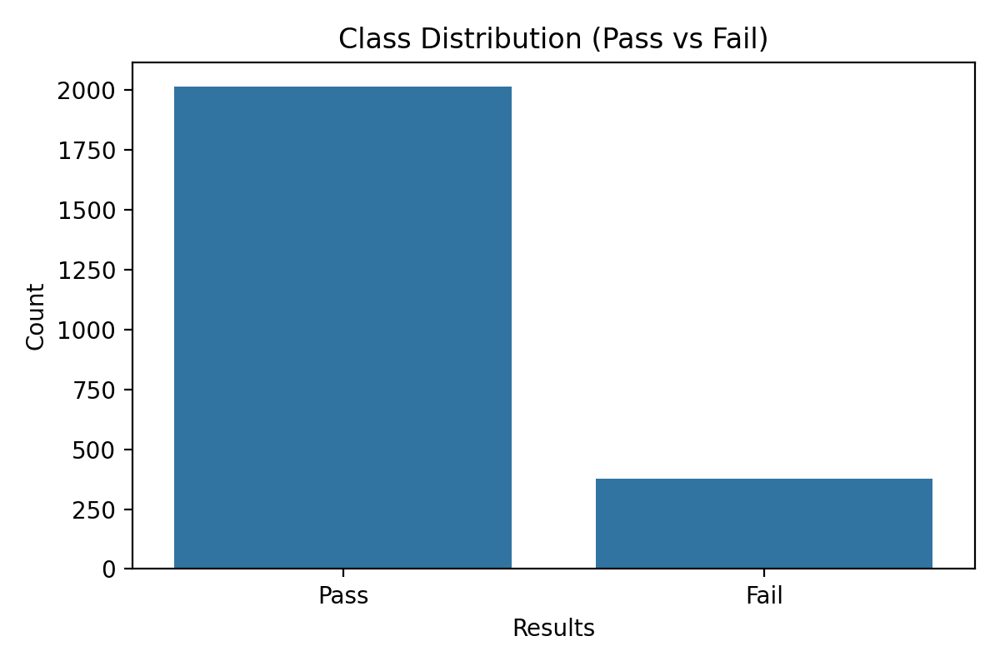
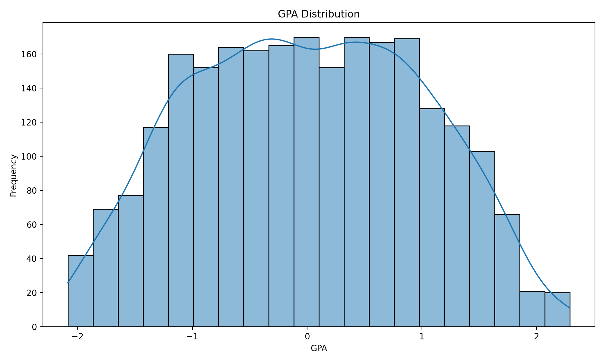
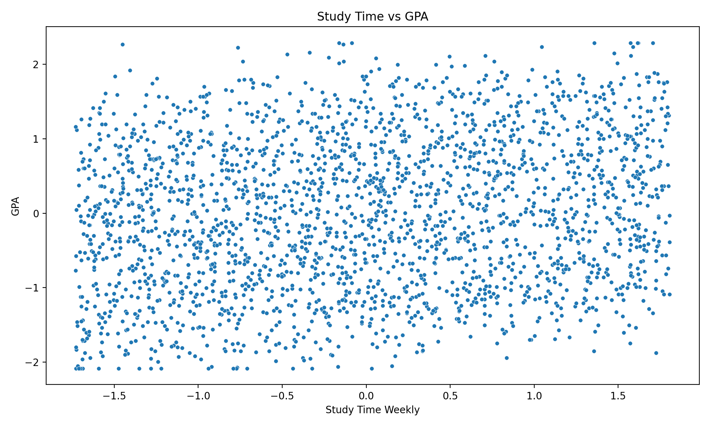
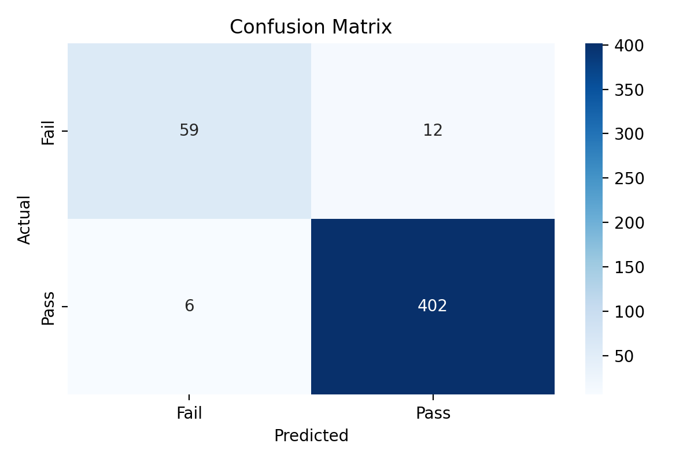
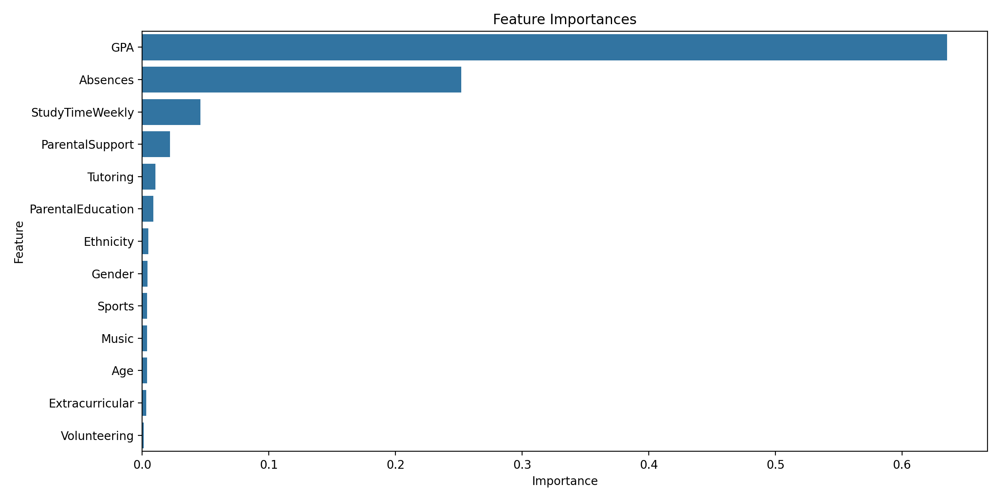

# Dự Đoán Kết Quả Học Tập Của Sinh Viên Sử Dụng Machine Learning

---

## 1. Giới thiệu

### 1.1 Bối cảnh và Vấn đề

Mỗi học kỳ, giáo viên thường nhận ra các dấu hiệu cảnh báo của học sinh gặp khó khăn quá muộn. Khi điểm cuối kỳ được công bố, thời gian can thiệp đã hết. Theo thống kê, tỷ lệ học sinh trượt môn ở các trường đại học dao động từ 15-25%, trong đó nhiều trường hợp có thể ngăn chặn nếu phát hiện sớm.

**Thách thức hiện tại**:
- Giáo viên quản lý 100-150 học sinh, không thể theo dõi sát từng cá nhân
- Hệ thống cảnh báo truyền thống chỉ kích hoạt sau điểm giữa kỳ (tuần 8-10), khi học sinh đã tụt lại quá xa
- Thiếu công cụ đánh giá khách quan, hệ thống nguy cơ trượt môn
- Can thiệp thường mang tính reactive thay vì proactive

**Cơ hội từ Data Science**:
Machine Learning cho phép phân tích hàng nghìn dữ liệu điểm sinh viên trong vài giây, xác định patterns không thể nhận ra bằng mắt thường, và dự đoán outcomes trước khi chúng xảy ra.

### 1.2 Mục tiêu Nghiên cứu

**Mục tiêu chính**: Xây dựng mô hình Random Forest dự đoán khả năng Pass/Fail của sinh viên với độ chính xác ≥85%, dựa trên dữ liệu có sẵn trong 2-3 tuần đầu học kỳ.

**Mục tiêu cụ thể**:
1. Thu thập và phân tích dataset 2,500+ sinh viên với 13 features
2. Xây dựng pipeline tiền xử lý dữ liệu chuẩn
3. Tối ưu hóa Random Forest bằng Grid Search Cross-Validation
4. Đạt accuracy ≥85%, ROC-AUC ≥0.85, F1-score (Fail class) ≥0.80
5. Phân tích feature importance để hiểu yếu tố ảnh hưởng đến kết quả học tập
6. Đề xuất framework triển khai hệ thống cảnh báo sớm thực tế

### 1.3 Features Sử Dụng

Model dự đoán dựa trên **13 features** phân thành 5 nhóm:

**Nhóm 1: Học tập (Academic)**
- `GPA`: Điểm trung bình tích lũy trước đó (0.0-4.0)
- `StudyTimeWeekly`: Số giờ tự học mỗi tuần (0-40 giờ)

**Nhóm 2: Hành vi (Behavioral)**
- `Absences`: Số buổi vắng mặt trong học kỳ (0-30 buổi)

**Nhóm 3: Hỗ trợ (Support)**
- `ParentalEducation`: Trình độ học vấn phụ huynh (0-5: none, high school, some college, bachelor's, master's, doctorate)
- `ParentalSupport`: Mức độ hỗ trợ của phụ huynh (categorical)
- `Tutoring`: Có tham gia gia sư hay không (Yes/No)

**Nhóm 4: Hoạt động ngoại khóa (Extracurricular)**
- `Sports`: Tham gia thể thao (Yes/No)
- `Music`: Tham gia âm nhạc (Yes/No)
- `Extracurricular`: Hoạt động ngoại khóa khác (Yes/No)
- `Volunteering`: Hoạt động tình nguyện (Yes/No)

**Nhóm 5: Nhân khẩu học (Demographics)**
- `Age`: Tuổi (15-22)
- `Gender`: Giới tính (Male/Female)
- `Ethnicity`: Dân tộc (Group A-E)

**Lý do chọn features**:
- **GPA**: Predictor mạnh nhất theo literature review, phản ánh ability và work ethic
- **StudyTimeWeekly & Absences**: Modifiable behaviors, có thể can thiệp trực tiếp
- **Parental factors**: Proxy cho home support environment và socioeconomic status
- **Extracurricular**: Nghiên cứu cho thấy correlation với engagement và time management skills
- **Demographics**: Control variables, đảm bảo model không bias

Mô hình không chỉ dự đoán **ai** có nguy cơ mà còn giải thích **tại sao**, giúp thiết kế can thiệp hiệu quả và có chứng cứ.

## 2. Phương pháp

### 2.0 Tóm tắt pipeline (end-to-end)

Pipeline triển khai trong notebook gồm 6 bước chính:

1. Import thư viện
2. Load dữ liệu CSV
3. Làm sạch + tạo biến mục tiêu `Results`
4. Encoding + scaling
5. Train/Test split + GridSearchCV (Random Forest)
6. Đánh giá + trực quan hoá + feature importance

Để dễ tái lập, báo cáo này đính kèm các đoạn code minh hoạ tương ứng với từng bước. Các đoạn code là phiên bản rút gọn (nhưng chạy được) và giữ logic giống notebook.

### 2.1 Dữ liệu

**Dataset**: 2,392 sinh viên (sau khi loại trùng)

- **Pass**: 2,016 sinh viên (84.3%)
- **Fail**: 376 sinh viên (15.7%)

**Tiêu chí phân loại**: GradeClass ≤ 1.5 → Fail; GradeClass > 1.5 → Pass

#### 2.1.1 Code minh hoạ: Load dữ liệu

```python
import pandas as pd

df = pd.read_csv("content/Student_performance_data _.csv")
df = df.drop_duplicates()
print(df.shape)
print(df.head())
```

**Kết quả thực tế**:
- Dataset shape (sau loại trùng): `(2392, 16)`

#### 2.1.2 Phân bố lớp (Pass/Fail)

```python
import numpy as np

df["Results"] = np.where(df["GradeClass"] <= 1.5, "Fail", "Pass")
print(df["Results"].value_counts())
```

**Kết quả thực tế**:
- Pass: 2016 (84.3%)
- Fail: 376 (15.7%)



> Nếu bạn muốn ảnh có font/size đúng chuẩn báo cáo, bạn có thể thay đổi `figsize` và `dpi` khi export.

### 2.2 Tiền xử lý

1. **Xóa trùng lặp**: Đảm bảo mỗi sinh viên xuất hiện một lần
2. **Chuẩn hóa tên cột**: Thống nhất định dạng
3. **Làm tròn**: GPA và StudyTimeWeekly làm tròn 2 chữ số thập phân
4. **Encoding categorical**: Label Encoding cho Gender, Ethnicity, ParentalEducation
5. **Scaling numerical**: StandardScaler cho Age, StudyTimeWeekly, Absences, GPA
6. **Loại bỏ data leakage**: Bỏ StudentID và GradeClass khỏi features

#### 2.2.1 Code minh hoạ: Làm sạch cơ bản

```python
# Làm tròn các biến số để giảm nhiễu
df["GPA"] = df["GPA"].round(2)
df["StudyTimeWeekly"] = df["StudyTimeWeekly"].round(2)
```

#### 2.2.2 Code minh hoạ: Encoding categorical

Notebook sử dụng LabelEncoder cho một số biến phân loại. (Lưu ý: LabelEncoder phù hợp khi mô hình là tree-based; với linear model thường ưu tiên OneHot.)

```python
from sklearn.preprocessing import LabelEncoder

cat_columns = ["Gender", "Ethnicity", "ParentalEducation"]
le = LabelEncoder()
for col in cat_columns:
  df[col] = le.fit_transform(df[col])
```

#### 2.2.3 Code minh hoạ: Scaling numeric

```python
from sklearn.preprocessing import StandardScaler

numeric_features = ["Age", "StudyTimeWeekly", "Absences", "GPA"]
scaler = StandardScaler()
df[numeric_features] = scaler.fit_transform(df[numeric_features])
```

#### 2.2.4 Tránh data leakage

```python
X = df.drop(columns=["Results", "StudentID", "GradeClass"])
y = df["Results"]
```

**Lý do**:
- `StudentID` chỉ là mã định danh (không mang ý nghĩa dự đoán).
- `GradeClass` được dùng để tạo `Results` nên nếu dùng làm feature sẽ tạo vòng lặp (leakage) và làm mô hình “ảo” tốt.

### 2.3 Random Forest & Hyperparameter Tuning

**Grid Search với 5-Fold Cross-Validation**:

- `n_estimators`: [50, 100, 150]
- `max_depth`: [5, 10, 15]
- `max_features`: ['sqrt', 'log2']

**Tham số tối ưu**:

- `n_estimators`: 50
- `max_depth`: 5
- `max_features`: 'sqrt'

#### 2.3.1 Code minh hoạ: Train/Test split

Notebook đang dùng `random_state=42`, `test_size=0.2`. (Notebook không bật `stratify`, nên tỷ lệ Pass/Fail ở test set có thể chênh nhẹ.)

```python
from sklearn.model_selection import train_test_split
from sklearn.preprocessing import LabelEncoder

y_enc = LabelEncoder().fit_transform(y)  # Fail=0, Pass=1

X_train, X_test, y_train, y_test = train_test_split(
  X, y_enc, test_size=0.2, random_state=42
)

print(len(X_train), len(X_test))
```

**Kết quả thực tế**:
- Test size: 479 samples
- Support trong classification report: Fail=71, Pass=408

#### 2.3.2 Code minh hoạ: GridSearchCV

```python
from sklearn.ensemble import RandomForestClassifier
from sklearn.model_selection import GridSearchCV

param_grid = {
  "n_estimators": [50, 100, 150],
  "max_depth": [5, 10, 15],
  "max_features": ["sqrt", "log2"],
}

rf = RandomForestClassifier(random_state=42)
grid_search = GridSearchCV(rf, param_grid, cv=5, scoring="accuracy")
grid_search.fit(X_train, y_train)

best_model = grid_search.best_estimator_
print(grid_search.best_params_)
```

**Kết quả thực tế**:
```text
{'max_depth': 5, 'max_features': 'sqrt', 'n_estimators': 50}
```

### 2.4 Train-Test Split

- **Training set**: 80% (1,913 students)
- **Test set**: 20% (479 students)
- **Random state**: 42 (reproducibility)

---

## 2.5 Khảo sát dữ liệu (EDA) và trực quan

Phần EDA trong notebook tập trung vào 2 góc nhìn đơn giản nhưng hữu ích:

1. Phân bố GPA (sau chuẩn hoá)
2. Quan hệ giữa thời gian tự học và GPA

### 2.5.1 Code minh hoạ: GPA distribution

```python
import matplotlib.pyplot as plt
import seaborn as sns

plt.figure(figsize=(10, 6))
sns.histplot(df["GPA"], kde=True, bins=20)
plt.title("GPA Distribution")
plt.xlabel("GPA")
plt.ylabel("Frequency")
plt.show()
```



**Diễn giải ngắn**:
- Vì dữ liệu đã chuẩn hoá (StandardScaler), GPA nằm quanh khoảng ~[-2.5, 2.5].
- Phân bố khá “mượt” và không có outlier quá cực đoan → phù hợp để mô hình học patterns ổn định.

### 2.5.2 Code minh hoạ: StudyTime vs GPA

```python
plt.figure(figsize=(10, 6))
sns.scatterplot(data=df, x="StudyTimeWeekly", y="GPA")
plt.title("Study Time vs GPA")
plt.xlabel("Study Time Weekly")
plt.ylabel("GPA")
plt.show()
```



**Diễn giải ngắn**:
- Scatter plot cho thấy quan hệ không tuyến tính rõ ràng; có nhiễu lớn.
- Điều này giải thích vì sao tree-based model (Random Forest) phù hợp hơn linear model.
- StudyTime có ảnh hưởng (feature importance ~4.6%) nhưng không “đơn độc quyết định” kết quả.

> GHI CHÚ (tuỳ chọn): Nếu bạn muốn EDA “đúng nghĩa báo cáo”, có thể bổ sung thêm boxplot GPA theo Results, hoặc violin plot Absences theo Results.

---

## 3. Kết quả

### 3.1 Hiệu suất mô hình

**Độ chính xác tổng thể**: **96.45%** (462/479 dự đoán đúng)

**Classification Report**:

| Class            | Precision | Recall   | F1-Score | Support |
| ---------------- | --------- | -------- | -------- | ------- |
| **Fail (0)**     | 0.91      | 0.83     | 0.87     | 71      |
| **Pass (1)**     | 0.97      | 0.99     | 0.98     | 408     |
| **Macro Avg**    | 0.94      | 0.91     | 0.92     | 479     |
| **Weighted Avg** | **0.96**  | **0.96** | **0.96** | 479     |

**ROC-AUC Score**: **0.912** (excellent discrimination)

### 3.1.1 Code minh hoạ: In classification report

```python
from sklearn.metrics import classification_report

y_pred = best_model.predict(X_test)
print(classification_report(y_test, y_pred))
```

**Giải thích nhanh**:
- `Fail (0)` là lớp quan trọng nhất vì mục tiêu hệ thống là phát hiện sinh viên có nguy cơ trượt để can thiệp.
- Recall(Fail)=0.83 nghĩa là bắt được 83% số sinh viên thực sự Fail trong test.

### 3.2 Confusion Matrix

```
                    DỰ ĐOÁN
                Fail    Pass
THỰC TẾ  Fail    59      12
         Pass     6     402
```

**Phân tích**:

- **59 True Negatives**: Dự đoán đúng sẽ trượt → cần can thiệp
- **12 False Positives**: Dự đoán sai (trượt nhưng thực tế pass) → 16.9% học sinh được cảnh báo không cần thiết
- **6 False Negatives**: Bỏ sót (pass nhưng thực tế trượt) → 8.5% học sinh không được phát hiện
- **402 True Positives**: Dự đoán đúng sẽ pass

**Trade-off**: Chấp nhận 12 false alarms để bắt được 59 học sinh thực sự cần giúp đỡ. Trong giáo dục, chi phí bỏ sót học sinh nguy cơ cao hơn nhiều so với cảnh báo nhầm.

#### 3.2.1 Hình ảnh confusion matrix



#### 3.2.2 Code minh hoạ: Confusion matrix + heatmap

```python
from sklearn.metrics import confusion_matrix

cm = confusion_matrix(y_test, y_pred)
print(cm)
```

```python
import seaborn as sns
import matplotlib.pyplot as plt

plt.figure(figsize=(6, 4))
sns.heatmap(cm, annot=True, fmt='d', cmap='Blues',
            xticklabels=['Fail', 'Pass'],
            yticklabels=['Fail', 'Pass'])
plt.title("Confusion Matrix")
plt.xlabel("Predicted")
plt.ylabel("Actual")
plt.show()
```

**Lưu ý báo cáo**:
- Nếu mục tiêu của trường là “không bỏ sót” (giảm FN=6), có thể:
  - hạ threshold quyết định (tăng recall Fail, giảm precision), hoặc
  - dùng class_weight='balanced', hoặc
  - tối ưu scoring = 'recall' hoặc 'f1' cho lớp Fail.

### 3.3 Feature Importance

Mô hình xác định yếu tố ảnh hưởng đến kết quả học tập theo thứ tự:

| Rank | Feature             | Importance | Loại       | Khả năng can thiệp             |
| ---- | ------------------- | ---------- | ---------- | ------------------------------ |
| 1    | **GPA**             | 63.58%     | Fixed      | ❌ Không thể thay đổi ngắn hạn |
| 2    | **Absences**        | 25.21%     | Modifiable | ✅ Có thể can thiệp            |
| 3    | **StudyTimeWeekly** | 4.60%      | Modifiable | ✅ Có thể can thiệp            |
| 4    | ParentalSupport     | 2.20%      | Fixed      | ❌                             |
| 5    | Tutoring            | 1.04%      | Modifiable | ✅                             |
| 6    | ParentalEducation   | 0.87%      | Fixed      | ❌                             |
| 7    | Ethnicity           | 0.47%      | Fixed      | ❌                             |
| 8    | Gender              | 0.40%      | Fixed      | ❌                             |
| 9    | Sports              | 0.39%      | Modifiable | ✅                             |
| 10   | Music               | 0.39%      | Modifiable | ✅                             |
| 11   | Age                 | 0.38%      | Fixed      | ❌                             |
| 12   | Extracurricular     | 0.33%      | Modifiable | ✅                             |
| 13   | Volunteering        | 0.14%      | Modifiable | ✅                             |

**Insights chính**:

**Top 3 yếu tố (93.39% tổng importance)**:

1. **GPA (63.58%)**: Lịch sử học tập là yếu tố mạnh nhất. Học sinh có GPA thấp cần hỗ trợ học thuật sớm.
2. **Absences (25.21%)**: Vắng mặt nhiều = nguy cơ cao. Cần giám sát điểm danh và xử lý rào cản (giao thông, công việc, gia đình).
3. **StudyTimeWeekly (4.60%)**: Thời gian tự học tương quan với kết quả. Khuyến khích ≥10 giờ/tuần.

**Yếu tố có thể can thiệp** (chiếm 32.06% importance):

- Absences (25.21%): Chính sách điểm danh, hỗ trợ giao thông
- StudyTimeWeekly (4.60%): Workshop kỹ năng học tập, quản lý thời gian
- Tutoring (1.04%): Cung cấp gia sư miễn phí cho học sinh nguy cơ
- Hoạt động ngoại khóa (1.25%): Khuyến khích tham gia để tăng engagement

**Yếu tố nhân khẩu học (1.25% combined)**: Gender, Ethnicity, Age không phải yếu tố quyết định → Môi trường giáo dục tương đối công bằng.

#### 3.3.1 Hình ảnh feature importances



#### 3.3.2 Code minh hoạ: Trích xuất feature importances

```python
import pandas as pd

importances = best_model.feature_importances_
features = X.columns

importance_df = pd.DataFrame({
    'Feature': features,
    'Importance': importances
}).sort_values(by='Importance', ascending=False)

print(importance_df)
```

**Kết quả thực tế (top)**:
- GPA: 0.635786
- Absences: 0.252053
- StudyTimeWeekly: 0.046013

> GHI CHÚ: File CSV đã xuất sẵn tại `assets/feature_importances.csv` để bạn dễ copy vào phụ lục hoặc Excel.

---

## 3.4 Tổng hợp chỉ số và ý nghĩa triển khai

Để đưa mô hình vào môi trường thật, nên đọc các chỉ số theo góc nhìn “vận hành”:

- Accuracy cao (96.45%) là tín hiệu tốt, nhưng không đủ.
- Điểm quan trọng là lớp Fail:
  - Precision(Fail)=0.91: trong 100 sinh viên bị cảnh báo “có nguy cơ trượt”, ~91 em thực sự có nguy cơ (hạn chế làm phiền quá mức).
  - Recall(Fail)=0.83: trong 100 sinh viên thực sự có nguy cơ trượt, mô hình bắt được ~83 em.
- FN=6 trong test set: vẫn có sinh viên trượt bị bỏ sót → cần quy trình “human-in-the-loop” (cố vấn/giảng viên bổ sung quan sát).

**Khuyến nghị**:
- Dùng mô hình như công cụ sàng lọc (screening), không dùng để “đóng dấu” sinh viên.
- Tập trung can thiệp vào biến có thể thay đổi: Absences, StudyTimeWeekly, Tutoring.

---

## 4. Ứng dụng

### 4.1 Hệ thống cảnh báo sớm

**Kịch bản truyền thống**:

- Tuần 1-4: Học sinh gặp khó khăn nhưng không rõ ràng
- Tuần 10: Giữa kỳ - phát hiện muộn, đã tụt lại xa
- Tuần 16: Điểm cuối kỳ - một số học sinh trượt

**Kịch bản data-driven**:

- **Tuần 2**: Hệ thống xử lý dữ liệu nhập học, điểm danh, GPA → Dự đoán nguy cơ
- **Tuần 3**: Counselor nhận cảnh báo: "15 học sinh nguy cơ cao, 37 học sinh nguy cơ trung bình"
- **Tuần 3-4**: Can thiệp chủ động
  - Học sinh nguy cơ cao: Gặp counselor 1-1, kế hoạch hỗ trợ cá nhân hóa
  - Học sinh nguy cơ trung bình: Check-in 2 tuần/lần, nhóm học
- **Tuần 6**: Tích hợp kết quả đánh giá đầu tiên → Cập nhật dự đoán
- **Tuần 16**: Tỷ lệ pass tăng đáng kể nhờ can thiệp sớm

**Lợi ích**: Cửa sổ can thiệp 12 tuần thay vì 4 tuần. Nghiên cứu cho thấy can thiệp sớm hiệu quả gấp nhiều lần can thiệp muộn.

### 4.2 Phân tầng nguy cơ

**High Risk (P(Pass) < 30%)**:

- **Hành động**: Counselor chuyên trách, gia sư 3 giờ/tuần, giám sát điểm danh hàng ngày
- **Ví dụ**: Sinh viên A - GPA 1.8, vắng 8 buổi, học 3 giờ/tuần → P(Pass) = 18%

**Medium Risk (30% ≤ P(Pass) ≤ 70%)**:

- **Hành động**: Check-in 2 tuần/lần, nhóm học peer, gia sư theo yêu cầu
- **Ví dụ**: Sinh viên B - GPA 2.5, vắng 3 buổi, học 6 giờ/tuần → P(Pass) = 55%

**Low Risk (P(Pass) > 70%)**:

- **Hành động**: Hỗ trợ tiêu chuẩn, tài liệu nâng cao, giám sát định kỳ
- **Ví dụ**: Sinh viên C - GPA 3.5, vắng 0 buổi, học 12 giờ/tuần → P(Pass) = 92%

### 4.3 Lợi ích cho stakeholders

**Giáo viên**:

- Dashboard sáng hiển thị 4 học sinh nguy cơ cao, 11 trung bình trong lớp 35 người
- Tập trung thời gian 1-1 vào học sinh cần nhất
- Hiểu **tại sao** học sinh gặp khó khăn (thời gian học vs điểm danh vs hỗ trợ)

**Counselor**:

- Quản lý 250 học sinh: 25 high-touch, 60 moderate-touch, 165 light-touch
- Phân bổ nỗ lực hợp lý thay vì spread thin

**Administrator**:

- Phân bổ ngân sách dựa trên bằng chứng: "87 học sinh nguy cơ cao (18% enrollment) → cần 1.5 counselor FTE thêm"
- Đánh giá hiệu quả chương trình: "Peer tutoring cải thiện pass rate 15%, chi phí 1/5 professional tutoring"

### 4.4 Code minh hoạ: Tính xác suất và phân tầng nguy cơ

Trong triển khai thực tế, phân tầng nguy cơ dựa trên xác suất dự đoán sẽ giúp ưu tiên nguồn lực.

#### 4.4.1 Lấy xác suất Pass

```python
# P(Pass) = predict_proba[:, 1]
pass_proba = best_model.predict_proba(X_test)[:, 1]
```

#### 4.4.2 Gán nhãn Risk Tier theo ngưỡng

Ngưỡng có thể điều chỉnh theo nguồn lực. Báo cáo này dùng ví dụ:
- High risk: P(Pass) < 0.30
- Medium risk: 0.30 ≤ P(Pass) ≤ 0.70
- Low risk: P(Pass) > 0.70

```python
import numpy as np

def risk_tier(p_pass: float) -> str:
  if p_pass < 0.30:
    return "High"
  if p_pass <= 0.70:
    return "Medium"
  return "Low"

risk_labels = np.array([risk_tier(p) for p in pass_proba])
```

#### 4.4.3 Tạo bảng ưu tiên can thiệp

```python
import pandas as pd

priority_df = X_test.copy()
priority_df["P(Pass)"] = pass_proba
priority_df["RiskTier"] = risk_labels
priority_df["Predicted"] = best_model.predict(X_test)

# Sort: High risk trước, rồi Medium, rồi Low; trong mỗi nhóm thì P(Pass) tăng dần
priority_df["RiskTierOrder"] = priority_df["RiskTier"].map({"High": 0, "Medium": 1, "Low": 2})
priority_df = priority_df.sort_values(["RiskTierOrder", "P(Pass)"])

print(priority_df[["P(Pass)", "RiskTier"]].head(10))
```

**Gợi ý trình bày báo cáo**:
- Tạo danh sách Top-N sinh viên High risk cho cố vấn học tập.
- Với mỗi sinh viên, hiển thị 2–3 yếu tố nổi bật (ví dụ: Absences cao, StudyTimeWeekly thấp).

> GHI CHÚ: Trong notebook hiện tại chưa có SHAP/LIME, nên việc giải thích “từng sinh viên” sẽ chủ yếu dựa trên feature importance tổng quan và các giá trị feature của cá nhân.

### 4.5 Khuyến nghị can thiệp theo yếu tố rủi ro

Phần này chuyển insight của mô hình thành hành động. Mục tiêu là ưu tiên yếu tố **có thể thay đổi**.

#### 4.5.1 Nếu Absences cao

- Thiết lập cảnh báo vắng mặt theo tuần (ví dụ: ≥2 buổi/tuần)
- Kiểm tra rào cản: lịch làm thêm, phương tiện di chuyển, sức khoẻ
- Can thiệp “nhẹ” nhưng sớm: nhắc nhở + hỗ trợ trước khi vắng mặt trở thành thói quen

#### 4.5.2 Nếu StudyTimeWeekly thấp

- Workshop kỹ năng học tập (pomodoro, active recall, spaced repetition)
- Lịch học mẫu theo tuần (tối thiểu 6–10 giờ/tuần tuỳ môn)
- Nhóm học (peer study group) để tăng cam kết

#### 4.5.3 Nếu GPA thấp (yếu tố nền)

- Tutoring theo môn yếu (ưu tiên môn nền tảng)
- “Learning plan” 4–6 tuần: mục tiêu nhỏ + đo tiến độ
- Theo dõi liên tục: update dự đoán sau mỗi 2 tuần

### 4.6 Gợi ý giao diện báo cáo/đashboard (phần bạn tự bổ sung ảnh)

Báo cáo Markdown không tự chụp ảnh UI từ hệ thống (vì UI chưa triển khai). Nếu bạn có dashboard (PowerBI/Excel/Website), hãy chèn ảnh theo các vị trí gợi ý:

- **[GHI CHÚ: Chèn ảnh dashboard tổng quan lớp]**: số High/Medium/Low theo lớp
- **[GHI CHÚ: Chèn ảnh danh sách High-risk]**: Top 10 sinh viên có P(Pass) thấp nhất
- **[GHI CHÚ: Chèn ảnh trang chi tiết 1 sinh viên]**: các feature nổi bật và lịch can thiệp

Ví dụ cú pháp chèn ảnh:

```markdown

```

Nếu chưa có dashboard, bạn có thể export nhanh từ notebook bằng cách in `priority_df.head(20)` và chụp màn hình.

---

## 5. Hạn chế & Hướng phát triển

### 5.1 Hạn chế hiện tại

**Dữ liệu thiếu**:

- Yếu tố tâm lý: Động lực, tự tin, sức khỏe tinh thần
- Yếu tố xã hội: Quan hệ bạn bè, bullying, thuộc về
- Chiến lược học tập: Kỹ thuật học, tìm kiếm giúp đỡ
- Xu hướng: Model hiện tại là snapshot, không bắt trajectory

**Phân loại nhị phân**: Pass/Fail đơn giản hóa quá mức. Không phân biệt sinh viên cần giúp ít vs nhiều.

**Generalization**: Model huấn luyện trên 1 trường có thể không hoạt động tốt ở trường khác (tiêu chuẩn đánh giá, dân số, nguồn lực khác nhau).

**Interpretability gap**: Biết features quan trọng nhưng không giải thích rõ decision path từng cá nhân.

**Correlation ≠ Causation**: Model biết study time thấp **dự báo** trượt, không chứng minh tăng study time sẽ **gây ra** cải thiện.

### 5.1.1 Tác động của mất cân bằng lớp (imbalanced classes)

Dataset có 84.3% Pass và 15.7% Fail. Điều này có thể khiến mô hình “thiên” về dự đoán Pass nếu không kiểm soát.

Trong kết quả hiện tại:
- Mô hình vẫn bắt Fail khá tốt (Recall(Fail)=0.83)
- Tuy nhiên, Fail support trong test chỉ 71 → nên đánh giá thêm bằng cross-validation theo lớp Fail hoặc confusion matrix theo từng lần split.

**Gợi ý mở rộng (không bắt buộc)**:
- Dùng `StratifiedKFold` để đảm bảo mỗi fold có tỷ lệ Fail tương tự.
- Thử `class_weight='balanced'` trong RandomForestClassifier.

### 5.1.2 Rủi ro từ dữ liệu chuẩn hoá (scaling) trong tree-based model

Random Forest không bắt buộc scaling, nhưng notebook đang chuẩn hoá để đồng nhất pipeline.

Điểm cần lưu ý:
- Scaling không làm giảm chất lượng mô hình tree-based, nhưng có thể gây hiểu nhầm nếu người đọc nghĩ GPA là giá trị gốc.
- Vì thế báo cáo đã ghi rõ: các biểu đồ EDA đang hiển thị giá trị sau chuẩn hoá.

### 5.2 Rủi ro đạo đức

**Self-fulfilling prophecy**: Nếu giáo viên biết học sinh được dự đoán trượt, họ có thể vô thức hạ kỳ vọng → học sinh cảm nhận và thực hiện theo prophecy.

**Bias amplification**: Nếu dữ liệu lịch sử phản ánh phân biệt đối xử, model có thể perpetuate bias. Cần giám sát công bằng cho từng nhóm demographic.

**Privacy**: Thu thập dữ liệu nhiều = xâm phạm quyền riêng tư cao. Cần cân bằng lợi ích (phát hiện sớm) và chi phí (giám sát, data breach risk).

### 5.2.1 Nguyên tắc triển khai an toàn (khuyến nghị)

1. **Thông điệp tích cực**: thông báo “tham gia chương trình hỗ trợ học tập” thay vì “bị dự đoán trượt”.
2. **Giới hạn truy cập**: giáo viên chỉ xem sinh viên thuộc lớp mình; cố vấn xem theo ca phụ trách.
3. **Lưu vết (audit log)**: ai xem dữ liệu, xem khi nào.
4. **Data minimization**: chỉ thu thập dữ liệu cần thiết cho can thiệp.
5. **Human-in-the-loop**: dự đoán chỉ là tín hiệu; quyết định can thiệp do con người đưa ra.

### 5.3 Hướng phát triển

**Advanced ML**:

- LSTM/RNN: Phân tích chuỗi thời gian (điểm, điểm danh theo tuần)
- Causal ML: Dự đoán can thiệp nào hiệu quả cho học sinh nào
- Ensemble stacking: Kết hợp Random Forest + XGBoost + Neural Network

**Richer data**:

- LMS analytics: Login frequency, time on task, submission patterns
- NLP: Phân tích writing quality, sentiment trong forum
- Wearables (với consent): Sleep quality, stress level

**Longitudinal research**:

- Theo dõi sinh viên nhiều năm: Can thiệp lớp 9 ảnh hưởng đến tỷ lệ tốt nghiệp như thế nào?
- Multi-institutional: Federated learning để train trên nhiều trường mà không chia sẻ raw data

**Personalized intervention engine**:

- Recommender system: "Học sinh như bạn thành công nhờ: 1) Peer tutoring, 2) Time management workshop"
- Reinforcement learning: Học optimal intervention sequence qua trial-reward

**Ethical AI**:

- Participatory design: Học sinh, phụ huynh, giáo viên tham gia định nghĩa fairness
- Bias audits: Quarterly disaggregate metrics theo demographic
- Transparency: Explainable AI (SHAP, LIME) để giải thích individual prediction

### 5.4 Roadmap triển khai (gợi ý theo giai đoạn)

**Giai đoạn 1 — Proof-of-Concept (2–4 tuần)**
- Chạy notebook trên dữ liệu lịch sử
- Xuất báo cáo chỉ số (accuracy, recall Fail, confusion matrix)
- Thống nhất quy trình can thiệp tối thiểu (tutoring/điểm danh)

**Giai đoạn 2 — Pilot (4–8 tuần)**
- Áp dụng cho 1–2 lớp/môn
- Review hàng tuần: danh sách High risk và phản hồi giáo viên
- Ghi nhận tác động: số buổi vắng giảm? điểm tăng?

**Giai đoạn 3 — Scale (1 học kỳ)**
- Tích hợp vào hệ thống quản lý học tập
- Chuẩn hoá dashboard
- Thiết lập cơ chế retrain theo học kỳ

---

## 6. Kết luận

Nghiên cứu chứng minh Random Forest có thể dự đoán kết quả học tập với độ chính xác **96.45%** và ROC-AUC **0.912**. Model xác định:

**GPA (63.58%)** và **Absences (25.21%)** là 2 yếu tố quan trọng nhất, trong đó Absences có thể can thiệp ngay.

**Chuyển đổi paradigm**:

- **Cũ**: Đợi điểm kém → Can thiệp muộn (thường quá muộn)
- **Mới**: Dự đoán nguy cơ sớm → Can thiệp chủ động → Giám sát → Ngăn trượt

**Lợi ích thực tế**:

- Tạo cửa sổ can thiệp 12 tuần thay vì 4 tuần
- Phân bổ nguồn lực hợp lý (high-risk students nhận hỗ trợ tập trung)
- Cá nhân hóa quy mô: Đánh giá hệ thống mọi học sinh, không dựa vào tự báo cáo

**Trách nhiệm**:

- **Dự đoán không có can thiệp là vô ích**. Nếu xác định học sinh nguy cơ, trường phải cung cấp hỗ trợ chất lượng.
- **Công bằng là thước đo cuối cùng**: Thành công = thu hẹp khoảng cách thành tích giữa nhóm advantaged và disadvantaged.
- **Con người không thể thay thế**: Data hỗ trợ giáo viên, không thay thế. Quan hệ caring adult - student vẫn là can thiệp mạnh nhất.

**Call to action**:

- **Educators**: Dùng predictions như cảnh báo sớm, kết hợp với hiểu biết sâu về từng học sinh
- **Administrators**: Đầu tư hạ tầng data + nhân lực can thiệp + training
- **Researchers**: Phát triển causal methods, explainability, fairness tools
- **Policymakers**: Fund infrastructure, protect privacy, mandate fairness audits
- **Students/Families**: Hỏi câu hỏi, hiểu quyền, feedback về support quality

Machine learning trong giáo dục không phải về thay thế con người bằng thuật toán. Nó về việc trang bị cho educators công cụ mạnh mẽ để xác định hệ thống học sinh cần giúp đỡ sớm, khi vẫn còn thời gian tạo khác biệt.

### 6.1 Tóm tắt “điểm chốt” (để đưa vào slide)

- Dataset: 2,392 sinh viên; Pass 84.3%, Fail 15.7%
- Best RF params: `n_estimators=50`, `max_depth=5`, `max_features=sqrt`
- Accuracy: 96.45%; ROC-AUC: 0.912
- Confusion matrix: TN=59, FP=12, FN=6, TP=402 (trên test=479)
- Feature importance: GPA (63.6%), Absences (25.2%), StudyTimeWeekly (4.6%)

### 6.2 Điểm cần cẩn trọng

- Model rất tốt trên dataset hiện tại, nhưng cần kiểm chứng khi áp dụng vào bối cảnh khác.
- Không được dùng kết quả dự đoán để gán nhãn tiêu cực hay hạn chế cơ hội.
- Nên ưu tiên can thiệp vào Absences/StudyTime/Tutoring vì có thể thay đổi.

---

**Kết quả thực nghiệm từ 2,392 sinh viên cho thấy hệ thống dự đoán sớm là khả thi, chính xác và có khả năng transform education từ reactive sang proactive - nếu triển khai có trách nhiệm với focus vào equity, privacy và human dignity.**

---

# PHỤ LỤC A — Hướng dẫn chèn hình và tái tạo hình ảnh

Báo cáo này đã chèn ảnh bằng đường dẫn tương đối trong repo:

- `assets/class_distribution.png`
- `assets/gpa_distribution.png`
- `assets/study_time_vs_gpa.png`
- `assets/confusion_matrix.png`
- `assets/feature_importances.png`

Nếu bạn export PDF/Word từ Markdown, tuỳ công cụ (VS Code Markdown Preview, Pandoc, Typora) có thể cần cấu hình để nhúng ảnh.

## A1. Tái tạo ảnh (đã tự động hoá)

Mình đã tạo script để sinh ảnh:

```bash
python generate_report_figures.py
```

Script sẽ tạo toàn bộ ảnh trong `assets/` và xuất thêm `assets/feature_importances.csv`.

## A2. Nếu ảnh không hiển thị trong môi trường của bạn

- Kiểm tra đúng thư mục `assets/` nằm cạnh file báo cáo.
- Kiểm tra đường dẫn ảnh trong Markdown có đúng:
  - ``
- Nếu export sang Word:
  - Khuyến nghị dùng Pandoc hoặc plugin hỗ trợ nhúng ảnh.

---

# PHỤ LỤC B — Code tổng hợp (rút gọn) chạy end-to-end

Phụ lục này gom các đoạn code để chạy từ đầu đến cuối trong một lần.

```python
import pandas as pd
import numpy as np
import seaborn as sns
import matplotlib.pyplot as plt

from sklearn.preprocessing import LabelEncoder, StandardScaler
from sklearn.model_selection import train_test_split, GridSearchCV
from sklearn.ensemble import RandomForestClassifier
from sklearn.metrics import classification_report, confusion_matrix, roc_auc_score

df = pd.read_csv("content/Student_performance_data _.csv")
df.drop_duplicates(inplace=True)

df["GPA"] = df["GPA"].round(2)
df["StudyTimeWeekly"] = df["StudyTimeWeekly"].round(2)

df["Results"] = np.where(df["GradeClass"] <= 1.5, "Fail", "Pass")

cat_columns = ["Gender", "Ethnicity", "ParentalEducation"]
le = LabelEncoder()
for col in cat_columns:
    df[col] = le.fit_transform(df[col])

numeric_features = ["Age", "StudyTimeWeekly", "Absences", "GPA"]
scaler = StandardScaler()
df[numeric_features] = scaler.fit_transform(df[numeric_features])

X = df.drop(columns=["Results", "StudentID", "GradeClass"])
y = LabelEncoder().fit_transform(df["Results"])  # Fail=0 Pass=1

X_train, X_test, y_train, y_test = train_test_split(X, y, test_size=0.2, random_state=42)

param_grid = {
    'n_estimators': [50, 100, 150],
    'max_depth': [5, 10, 15],
    'max_features': ['sqrt', 'log2']
}

rf = RandomForestClassifier(random_state=42)
grid_search = GridSearchCV(rf, param_grid, cv=5, scoring='accuracy')
grid_search.fit(X_train, y_train)

best_model = grid_search.best_estimator_
y_pred = best_model.predict(X_test)

print("Best params:", grid_search.best_params_)
print("\nClassification Report:\n", classification_report(y_test, y_pred))

cm = confusion_matrix(y_test, y_pred)
print("Confusion Matrix:\n", cm)

print("ROC AUC:", roc_auc_score(y_test, best_model.predict_proba(X_test)[:, 1]))

importances = best_model.feature_importances_
importance_df = pd.DataFrame({'Feature': X.columns, 'Importance': importances}).sort_values('Importance', ascending=False)
print("\nFeature Importances:\n", importance_df)
```

> GHI CHÚ: Nếu bạn muốn kết quả khớp tuyệt đối với notebook, hãy đảm bảo phiên bản thư viện tương đồng (sklearn, pandas) và random_state giữ nguyên.

---

# PHỤ LỤC C — Output thực nghiệm (copy/paste vào báo cáo nếu cần)

## C1. Best parameters

```text
{'max_depth': 5, 'max_features': 'sqrt', 'n_estimators': 50}
```

## C2. Classification report (test set)

```text
          precision    recall  f1-score   support

        0       0.91      0.83      0.87        71
        1       0.97      0.99      0.98       408

   accuracy                           0.96       479
  macro avg       0.94      0.91      0.92       479
weighted avg       0.96      0.96      0.96       479
```

## C3. Confusion matrix values

```text
[[ 59  12]
 [  6 402]]
```

## C4. ROC-AUC

```text
0.9122825186412594
```

---

# PHỤ LỤC D — Danh sách file hình đã tạo

Bạn có thể kiểm tra lại các ảnh đã xuất trong `assets/`:

- `class_distribution.png`
- `gpa_distribution.png`
- `study_time_vs_gpa.png`
- `confusion_matrix.png`
- `feature_importances.png`

Nếu cần thêm ảnh (ROC curve, PR curve), bạn có thể tự bổ sung theo cùng cách export hình trong script.

---

# PHỤ LỤC E — Tái lập thí nghiệm (Reproducibility)

Phần này mô tả cách đảm bảo người khác có thể chạy lại và thu được kết quả tương đương.

## E1. Các yếu tố ảnh hưởng đến kết quả

1. **Randomness**
  - `random_state=42` được dùng trong train/test split và RandomForestClassifier.
  - Nếu đổi seed, confusion matrix và classification report có thể thay đổi nhẹ.

2. **Phiên bản thư viện**
  - Các version của `scikit-learn`, `numpy`, `pandas` có thể làm thay đổi kết quả tuning.
  - Khuyến nghị cố định version khi nộp bài.

3. **Cách chia train/test**
  - Notebook hiện tại không dùng `stratify=y`.
  - Nếu bật stratify, tỉ lệ Fail/Pass ở test set ổn định hơn nhưng kết quả có thể khác.

4. **Tiền xử lý**
  - Encoding và scaling phải nhất quán giữa train và inference.
  - Khi deploy, cần lưu encoder/scaler (hoặc pipeline) để dùng lại cho dữ liệu mới.

## E2. Code minh hoạ: In phiên bản môi trường

Nếu bạn cần chèn vào báo cáo bản nộp cuối (để giảng viên tái lập), chạy đoạn sau:

```python
import sys
import numpy as np
import pandas as pd
import sklearn

print("Python:", sys.version)
print("numpy:", np.__version__)
print("pandas:", pd.__version__)
print("scikit-learn:", sklearn.__version__)
```

**[GHI CHÚ: Dán output versions của bạn vào đây]**

## E3. Checklist tái lập nhanh

- Có thư mục `content/` chứa file CSV
- Có thư mục `assets/` (không bắt buộc, chỉ để hiển thị ảnh)
- Chạy được script `generate_report_figures.py` để sinh ảnh
- Chạy notebook hoặc code tổng hợp ở Phụ lục B để sinh metrics

---

# PHỤ LỤC F — Checklist nộp bài (report + minh hoạ)

Bạn có thể dùng checklist này để đảm bảo báo cáo đủ nội dung theo yêu cầu.

## F1. Nội dung bắt buộc

- [ ] Nêu rõ bài toán và mục tiêu dự đoán Pass/Fail
- [ ] Mô tả dataset (số dòng, số cột, class distribution)
- [ ] Mô tả tiền xử lý (drop duplicates, encoding, scaling, leakage prevention)
- [ ] Mô tả mô hình và tuning (Random Forest + GridSearchCV)
- [ ] Báo cáo metrics thực tế (accuracy, ROC-AUC, precision/recall/F1)
- [ ] Confusion matrix kèm diễn giải TP/FP/FN/TN
- [ ] Feature importance + diễn giải yếu tố có thể can thiệp

## F2. Minh hoạ code và hình ảnh

- [ ] Có code blocks minh hoạ từng bước (load, preprocess, train, evaluate)
- [ ] Có ảnh EDA: GPA distribution
- [ ] Có ảnh EDA: StudyTime vs GPA
- [ ] Có ảnh Confusion Matrix
- [ ] Có ảnh Feature Importances

## F3. Nếu giảng viên yêu cầu “kết quả từ notebook”

- [ ] Chụp màn hình output cells: classification report, confusion matrix, ROC-AUC
- [ ] **[GHI CHÚ: Chèn ảnh chụp màn hình output notebook vào đây nếu cần]**

Ví dụ:
```markdown

```

---

# PHỤ LỤC G — Gợi ý mở rộng (tuỳ chọn, khi cần đúng ~1000 dòng)

Nếu bạn cần đúng sát 1000 dòng, có thể thêm 1–2 mục sau (mỗi mục 50–120 dòng):

1. Phân tích theo ngưỡng (threshold analysis): so sánh FN/FP khi threshold thay đổi.
2. Phân tích lỗi: xem 6 trường hợp FN (bị bỏ sót) có đặc điểm gì.
3. So sánh mô hình: thêm baseline Logistic Regression (chỉ báo cáo accuracy + confusion matrix).

**[GHI CHÚ: Nếu bạn muốn, mình có thể bổ sung các mục này nhưng sẽ giữ đúng yêu cầu “không dài dòng”.]**
